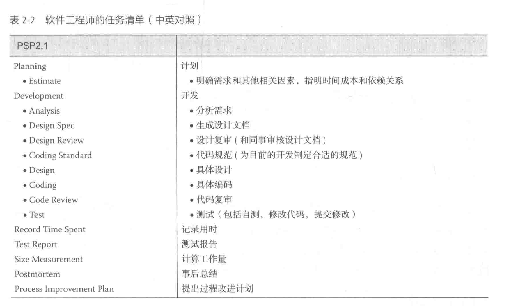

# 《构建之法》第三版读书笔记

## 个人技术和流程

### 单元测试的标准

1. 单元测试应该在最基本的功能、参数上验证程序的正确性
2. 单元测试必须由最熟悉代码的人（程序的作者）来写
3. 单元测试过后，机器状态保持不变
4. 单元测试要快（一个测试的运行时间是几秒钟，而不是几分钟）
5. 单元测试应该产生可重复、一致的结果
6. 独立性——单元测试的运行、通过、失败不依赖于别的测试，可以人为构造数据，以保持单元测试的独立性
7. 单元测试应该覆盖所有的代码路径

### 单一职责原则

一个模块（类）应该只有一个导致它变化的原因，一个模块应该完全对某个功能负责。

### 封闭-开放原则

软件实体应该是可以扩展的，同时是不可修改的。

具体的说：

- 允许修改。当应用的需求发生改变时，我们可以对模块进行扩展，从而改变模块的功能。
- 不允许修改。对模块进行扩展时，不必改变模块的本身。

### 效能分析工具的术语（微软系）

| 名词         | 英文             | 解释                                             |
| ------------ | ---------------- | ------------------------------------------------ |
| 消逝时间     | Elapsed Time     | 从用户角度来看花费的时间                         |
| 应用程序时间 | Application TIme | 应用程序占用 CPU 的时间                          |
| 本函数时间   | Exclusive Time   | 所有在本函数花费的时间，不包括被调用者花费的时间 |
| 所有时间     | Inclusive Time   | 包含本函数和所有被调用者的花费的时间             |

### 个人开发流程

## 软件工程师的成长

### 团队对个人的期望

1. 交流。
2. 说到做到。
3. 接受团队赋予的角色并按角色要求工作。
4. 全力投入团队的活动。
5. 按照团队流程的要求工作。
6. 准备。
7. 理性的工作。

### 软件工程师的思维误区

1. 分析麻痹。一种极端情况是想弄清楚所有细节、所有依赖关系之后再动手，心理上过于悲观，不想修复问题，出了问题都赖在相关问题上。
2. 不分主次，想解决所有依赖问题。
3. 过早优化。过早的优化是万恶之源。
4. 过早扩大化/泛化
